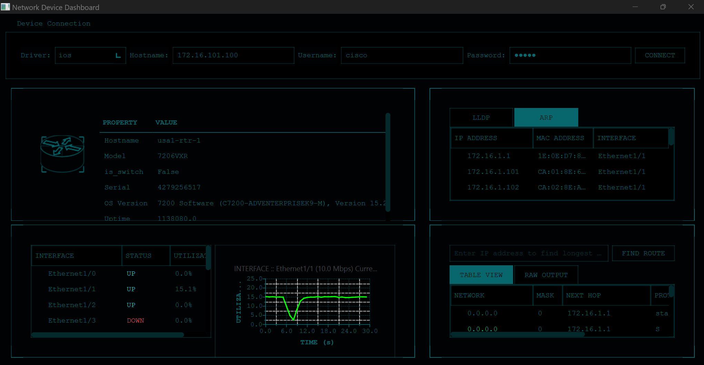
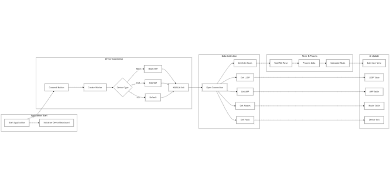

# Realtime Network Device Dashboard

A real-time network device monitoring dashboard built with Python and Qt6, supporting multiple network operating systems through NAPALM.

## Overview

The Network Device Dashboard provides a real-time interface for monitoring network devices, supporting IOS, EOS, and NXOS platforms. It features:

- Real-time interface utilization monitoring
- Device facts and status display
- Interface statistics with graphical visualization
- LLDP neighbor discovery
- ARP table monitoring
- IP routing table display

## Screenshot




## Features

- **Multi-Platform Support**: Works with Cisco IOS, Arista EOS, and Cisco NXOS
- **Real-Time Monitoring**: Updates device statistics every 5 seconds
- **Interface Tracking**: 
  - Status (UP/DOWN)
  - Utilization percentage
  - Historical graphing (30-second window)
- **Neighbor Discovery**:
  - LLDP neighbor information
  - ARP table entries
- **Routing Information**:
  - Route table display
  - Longest prefix match lookup

## Requirements

- Python 3.9+
- PyQt6
- NAPALM
- TextFSM
- Additional requirements in requirements.txt

## Installation

1. Clone the repository:
```bash
git clone https://github.com/scottpeterman/pytelemetry.git
```

2. Install dependencies:
```bash
pip install -r requirements.txt
```

3. Run the application:
```bash
python main.py
```

## Architecture

The application follows a modular architecture:

- `main.py`: Application entry point
- `device_dashboard.py`: Main UI and dashboard logic
- `device_info_worker.py`: Asynchronous device data collection
- `custom_driver.py`: Interface parsing and data processing
- `tfsm_fire.py`: TextFSM template parsing engine

## Usage

1. Launch the application
2. Enter device credentials:
   - Select appropriate driver (ios/eos/nxos)
   - Enter hostname/IP
   - Enter username/password
3. Click Connect
4. Monitor device statistics in real-time

## Development

The application uses:
- PyQt6 for the UI framework
- NAPALM for device interaction
- TextFSM for CLI output parsing
- Custom template database for interface parsing
- Qt charts for real-time graphing

## Contributing

1. Fork the repository
2. Create a feature branch
3. Commit changes
4. Push to the branch
5. Create a Pull Request

## License

This project is licensed under the GNU General Public License v3.0 - see the LICENSE file for details.

## Author

[Scott Peterman](https://github.com/scottpeterman)